# 变量类型与计算

## <a href="" id="1-1">面试题目</a>

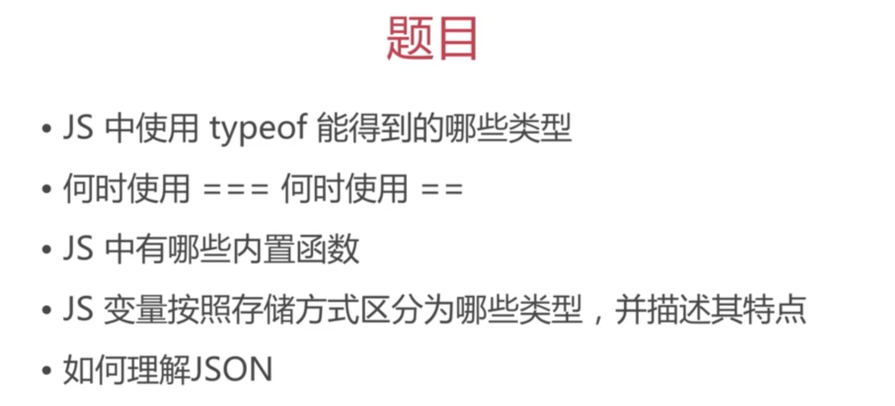

---


## <a href="" id="1-2">变量类型</a>

**变量类型有两种：**
 - **值类型**：(包括：Number、String、Bollean)值类型的每个变量都有独立的存储空间存贮对应的值。
 - **引用类型**：（包括：对象、数组、函数、null）引用类型是通过指针指向某个存储空间。所以，当你改变存储空间的数据后，所有指向该存储空间数据的变量的返回都会随之改变。

值类型：
```javascript
var a = 100;
var b = a;

a = 200;

console.log( b );  // 100
```

引用类型：
```javascript
var a = {age: 20, name: 'marco'}
var b = a;

a.age = 22;

console.log( b.age );  // 22
```

**为什么引用类型要这样设计？**
节省空间。因为不论是对象、数组还是函数，他们的属性都是可以随意添加的，这样就可能会有很多。比如，一个对象属性值很多，当把他赋值给b后如果是直接把整个对象拷贝给它的话  这类操作肯定会占用很多内存的，所以是不合理的。

### <a href="" id="1-2-1">JS中使用typeof能得到哪些类型？</a>

知识点：变量类型

答：typeof一共有6种类型： undefined、string、number、boolean、object、function

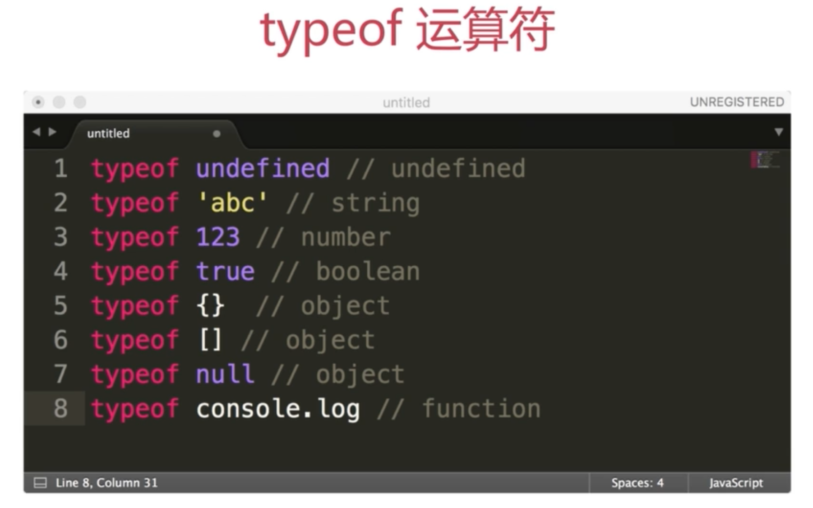

> 注意：typeof只能分辨出值类型，对于引用类型就无能为力了。引用类型它只能分辨出函数。为什么会这样呢？因为函数啊，是一种非常特别和使用非常频繁的一种类型。

> 注意： 返回的类型值都是字符串，如：“undefined”这种形式。


---


## <a href="" id="1-3">变量计算</a>

### <a href="" id="1-3-1">变量计算——强制类型转换</a>

JS强制类型转换发生在以下四种情况：
 - 字符串拼接
 - ==运算
 - if语句
 - 逻辑运算

> 注意：以上四种都是值类型 类型转换。

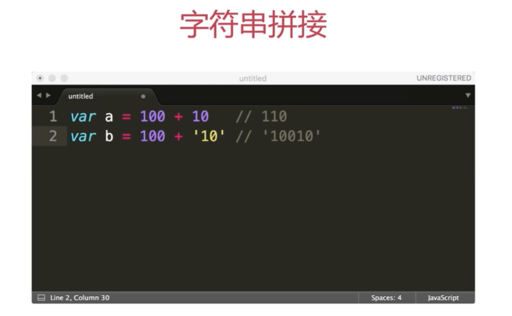

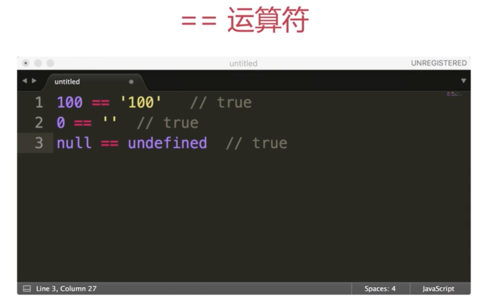

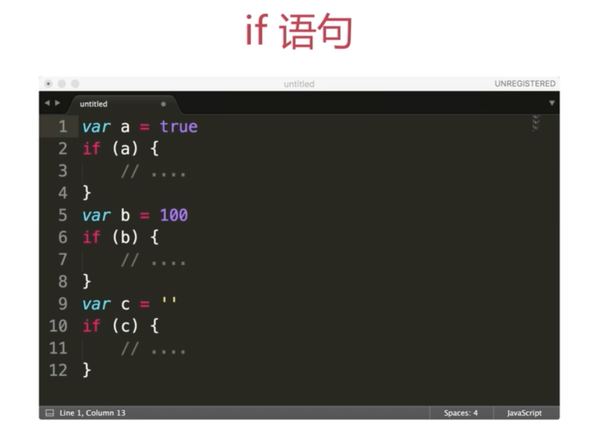


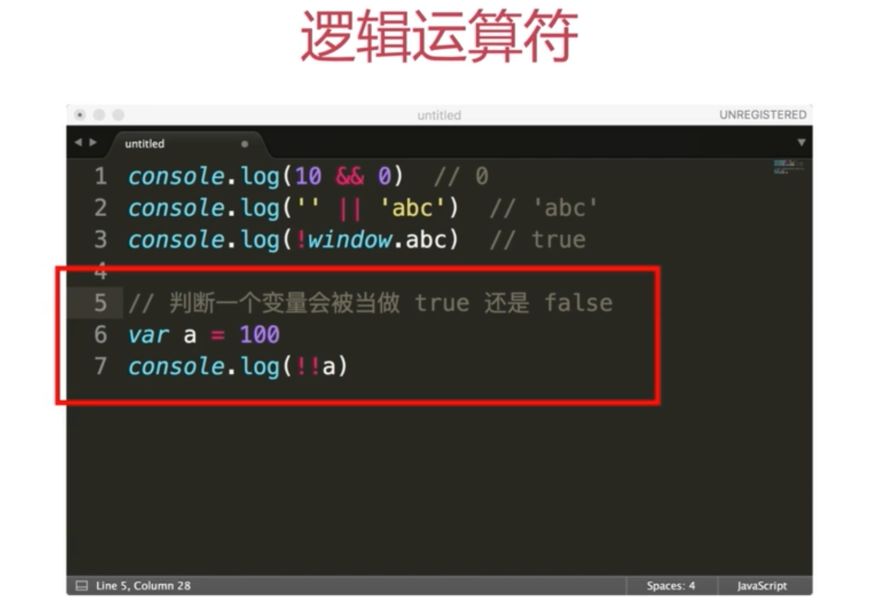


### <a href="" id="1-3-2">何时使用=== 何时使用==</a>

```javascript

// 问题： 何时使用=== 何时使用==

if (obj.a == null) {
    // 这里相当于obj.a === null || obj.undefined，简写形式; 除了这两个以外的情况都使用===
    // 这是 jquery 源码中推荐写法
}
```

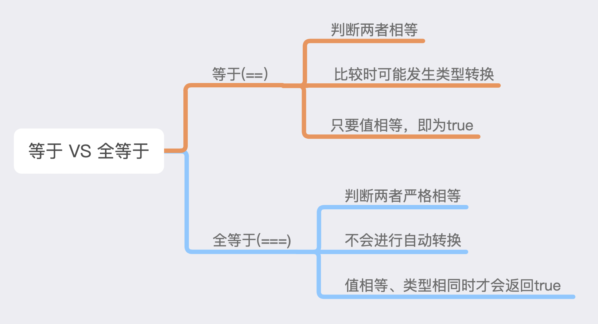

### <a href="" id="1-3-3">JS中有哪些内置函数</a>

一共9个：
`Object`、`Function`、`Array`、`Number`、`String`、`Boolean`、`Date`、`RegExp`、`Error`

### <a href="" id="1-3-4">JS按存储方式区分变量类型</a>

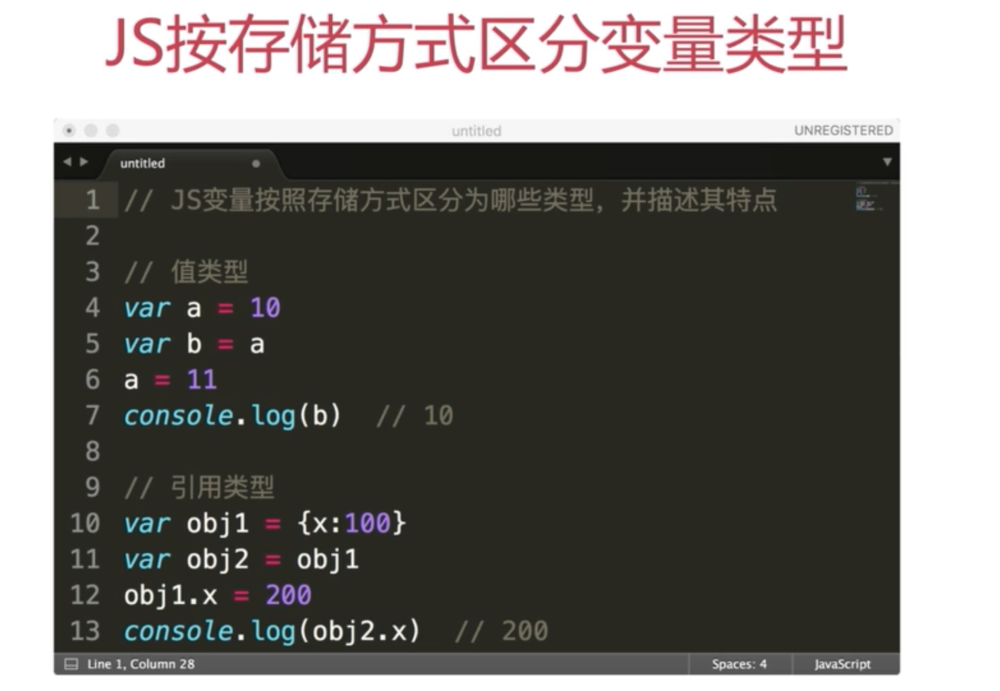


---

### <a href="" id="1-3-5">如何理解JSON</a>

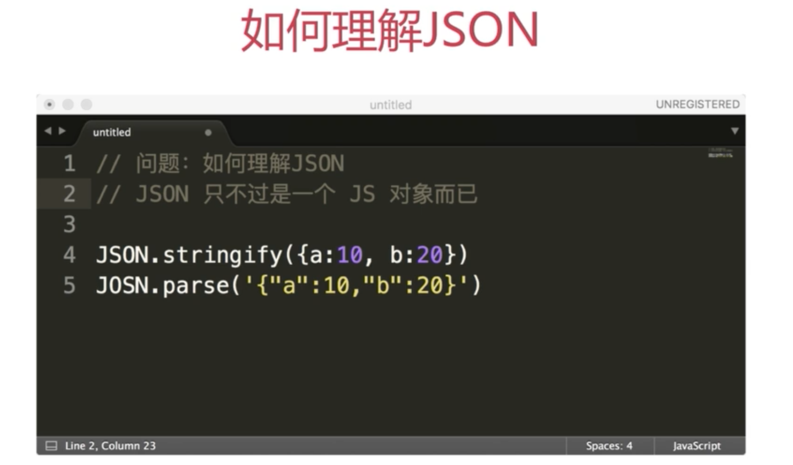

 - 按照书上说的话就是，JSON是一种轻量级数据交换格式。但是我不喜欢这么理解它，我比较喜欢把它说成是有JS数组和对象两种数据类型组合而成的复杂数据结构。通过数组和对象两种类型，就可以组合成各种我们需要的复杂的数据结构。
 - JSON不是一种语言，仅仅是一种数据的表达方式。


常用方法：
 - `jQuery.parseJSON(jsonstr)` - 将JSON字符串转换为JSON对象
 - `JSON.stringify(jsonObject )` - 将JSON对象转换成JSON字符串


# 原型和原型链——构造函数

## 知识点

### 构造函数

简单的说构造函数也是函数，就是重复执行的代码块。只是构造函数执行的是一个模板机制。

```javascript
function Foo(name, age) {
    this.name = name;
    this.age  = age;
    this.class = 'class-1';
    // return this;   //默认执行这行
}

var f = new Foo('G-Dragon', 22);  
// var f1 = new Foo('Marco', 25);  // 创建多个对对象
```

### 构造函数——扩展

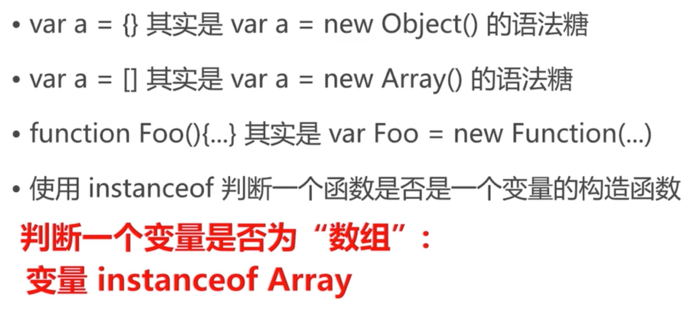


### 原型规则和示例

五条原型规则： **原型规则**是学习**原型链**的基础;
 1. 所有引用类型（数组、对象、函数），都具有对象特性，也就是可以自由的扩展属性（除了`null`以外）。
 2. 所有引用类型(数组、对象、函数)，都有一个`__proto__`（隐式原型）属性，属性值是一个普通对象。
 3. 所有的函数，都有一个`prototype`属性，属性值也是一个普通的对象。
 4. 所有的引用类型（数组、对象、函数）的`__proto__`属性值都指向它们构造函数的`prototype`属性值。
 5. 当试图得到某个对象的属性时，如果该对象本身没有这个属性，那么会去它的`__proto__`(也就是构造函数的`prototype`)中寻找。

示例代码：
```javascript
// 规则1
var obj = {};  obj = 100;
var arr = []; arr.a = 100;
function func() {}
func.a = 100;

// 规则2
console.log( a.__proto__);
console.log( arr.__proto__);
console.log( func.__proto__);

// 规则3
console.log( func.prototype );

// 规则4
console.log( obj.__proto__ == Object.prototype );


// 规则5
// 构造函数
function Foo(name, age) {
    this.name = name;
}

Foo.prototype.alertName = function () {
    alert( this.name );
}

//创建示例
var f = new Foo('G-Dragon');
f.printName = function() {
    console.log( this.name );
};

// 测试
f.printName();
f.alertName();

```

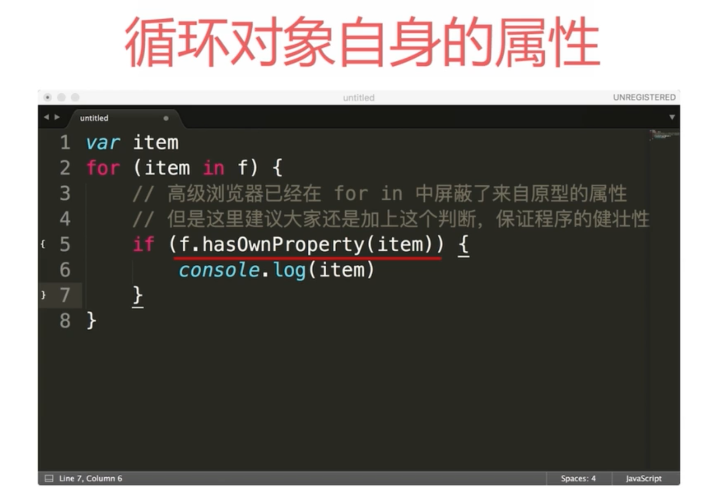

### 原型链

```js
// 构造函数
function Foo(name, age) {
    this.name = name;
}

Foo.prototype.alertName = function () {
    alert( this.name );
}

//创建示例
var f = new Foo('G-Dragon');
f.printName = function() {
    console.log( this.name );
};

// 测试
f.printName();
f.alertName();
f.toString();  //对象本身属性中没有，要到f.__proto__.__proto__中查找
```

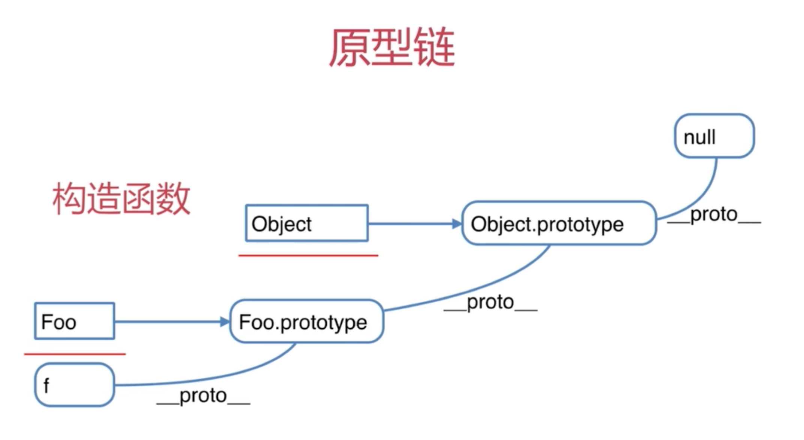

### instanceof

用于判断 **引用类型** 属于哪个 **构造函数** 的方法。

 - `f instanceof Foo`的判断逻辑是： `f` 的 `__proto__（隐式原型）`一层一层网上，能否找到 `Foo.prototype(显式原型)`。

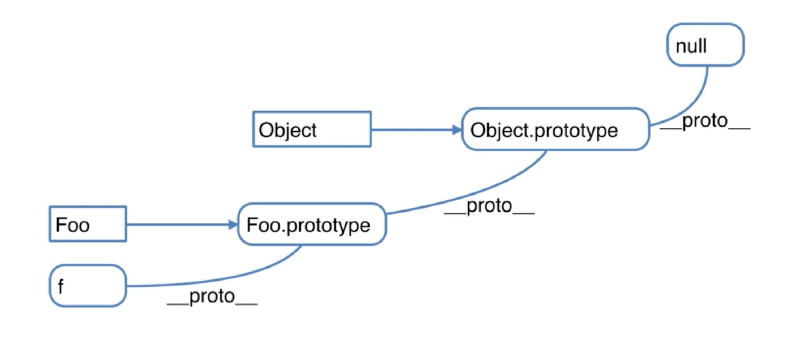

 - 再试着判断 `f instanceof Object`: 
 
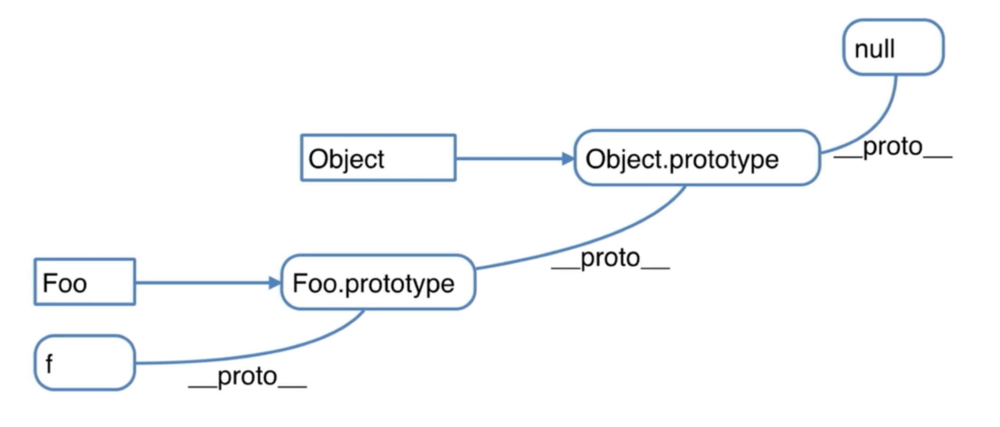


### this指向 
 - this 指的是当前对象
 - 函数中的this是在运行时候决定的，而不是函数定义时。
 - 在全局范围内使用this，则指代当前页面window
 - 在函数中使用this，则this指代什么是根据当前函数是在什么对象上调用
 - 我们可以使用call和apply改变函数中this的具体指向。

> 待总结：es6箭头函数中this指向情况？

```javascript
// 全局范围内使用this指代当前页面window
var a = 'apple'
window.a == this.a 


// this 指向对象
var o = {
  fruit: 'apple',
  foo: function () {
    console.log(this.fruit);
  }
}
o.foo()


// 使用apply和call改变this指向
var o = {
  fruit: 'apple',
  foo: function () {
    console.log(this.fruit);
  }
}
o.foo()
```

#### apply和call的区别

apply和call的唯一区别，就是在传参的时候，apply的参数需要放在一个数组里面，而call不需要；

https://www.cnblogs.com/long-long/p/6741083.html

---


## 题目

### 如何判断一个变量是数组类型

```javascript
var arr = [];
arr instanceof Array;   //true
typeof arr;   //"object", typeof 是无法判断是否是数组的
```

### 写一个原型链继承例子

```javascript
// 动物
function Animal() {
    this.eat = function() {
        console.log('Animal eat');
    }
}

// 狗
function Dog() {
    this.bark = function() {
        console.log('Dog bark');
    }
}

Dog.prototype = new Animal();
// 哈士奇
var hashiqi = new Dog();


```

> 注：面试中不要这么写，太low。 要写个贴近实战的例子。

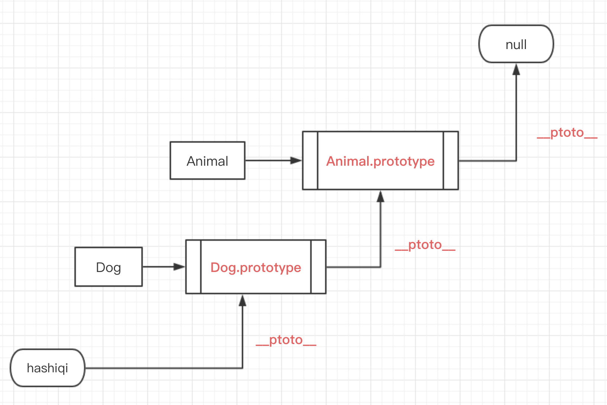


### 描述new一个对象的过程

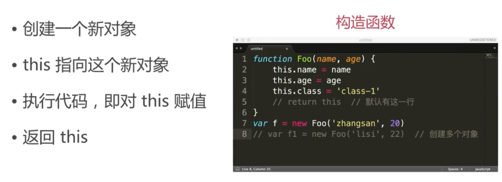


### zepto(或其他框架)源码中如何使用原型链

> 如何阅读源码：
> - 阅读源码是高效提高技能的方法。
> - 但不能“埋头苦钻” 有技巧在其中。

```javascript
function Elem (id) {
    this.elem = document.getElementById(id);
}

Elem.prototype.html = function(val) {
    var elem = this.elem;

    if (val) {
        elem.innerHTML = val;
        return this;
    } else {
        return elem.innerHTML
    }
}

Elem.prototype.on = function(type, callback) {
    var elem = this.elem;
    elem.addEventListener(type, callback);
    return this;
}

var div1 = new Elem('div1');
// console.log( div1.html() );

div1.html('<p>hello world</p>').on('click', function() {
    alert('click');
}).html('<p>clicked</p>')
```


