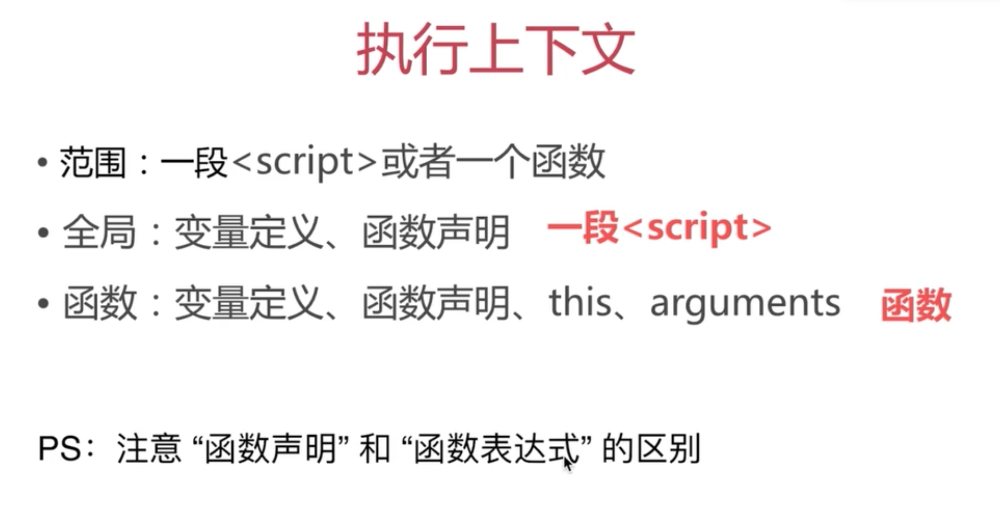

# 定义函数

两种方式：函数声明 和 函数表达式。

```javascript
function fn() {
    // 声明函数
}

var fn1 = function() {
    // 表达式
}
```

---


# 提升

在代码执行之前，会把变量和函数声明提前。

**区别：**
 - 变量提升：只提升声明，赋值并不会被提升；
 - 函数提升：是把函数整体提升；

---

# this

## this指向
在js中，this的指向不是固定的，而是可以改变的。下为this的默认指向：

    1. 定义在全局作用域中的普通函数中的this指向window对象（严格模式下，本条无效）
    2. 事件处理函数中的this指向触发事件的标签元素
    3. 构造函数中的this指向当前正在创建的对象（严格模式下必须用new）
    4. 原型中的函数内的this指向当前实例
    5. 其它框架中的函数内的this都有特定的指向

> [JavaScript中this指向的深入解析](https://www.imooc.com/article/48130)

# 作用域 和 闭包

## 题目

 - 说下对变量提升的理解。
 - 说下this的几种不同的使用场景。
 - 创建10个`<a>`标签，点击弹出对应的序号。
 - 如何理解作用域。
 - 实际开发中闭包的作用。

## 知识点

### 执行上下文



```javascript
console.log(a);
var a = 100;

fn('zhangsan');   // zhangsan  20
function fn(name) {
    age = 20;
    console.log(name, age);
    var age;
}
```

### this

JS是解释型语言，和编译型语言不同。只有当代码执行时才会报错。this要在执行时才能确认值，定义时无法确认。

```javascript
var a = {
    name: 'A',
    fn: function() {
        console.log(this.name);
    }
};

a.fn();   // this === a 
a.fn.call({name: 'B'});  // this === {name: 'B'}
var fn1 = a.fn;
fn1();    // this === window
```

this的几种使用情况：
```javascript
// 1. 构造函数中
// this指向当前实例
function Foo(name) {
    this.name = name;
}
var f = new Foo('zhangsan');


// 2. 对象中
// this指向的是当前对象
var obj = {
    name: 'A',
    printName: function() {
        console.log( this.name );
    }
}
obj.printName();

// 3. 全局范围内
// 指向的是window
function fn() {
    console.log( this );
}
fn();   


// call  apply  bind
// 指向的是新对象
function fn1(name, age) {
    alert( name );
    console.log( this );
}
fn1.call({x: 100}, 'zhangsan', 20);
fn1.apply({x: 100}, ['zhangsan', 20]);

var fn2 = function (name, age) {
    alert( name );
    console.log( this );
}.bind({x: 200});
fn2('zhangsan', 20);
```

### 作用域

### 什么是作用域？
作用域表示的是空间范围。在某个空间范围内，可以对数据进行读写操作。

- JS没有块作用域（es6之前）
- 只有函数和全局作用域；

```javascript
// 无块作用域
if (true) {
    var name = 'zhangsan';
}
console.log( name );

// 函数和全局作用域
var a = 100;
function fn() {
    var a = 200;
    console.log('fn', a);
}
console.log('global', a);
fn();
```

### 作用域链

#### 什么是作用域链？
作用域链可以理解为一套规则，如我们要引用一个变量，怎么查找它呢？就是借助作用域链。

```javascript
var a = 100;
function F1() {
    var b = 200;

    function F2() {
        var c = 300;
        console.log( a );  // a 自由变量
        console.log( b );  // b 自由变量
        console.log( c );
    }
    F2();
}
F1();
// 100
// 200
// 300
```

### 闭包

```javascript
function F1() {
    var a = 100;

    // 返回一个函数（函数作为返回值）
    return function() {
        console.log( a );
    }
}

var f1 = F1();
var a = 200;
f1();  // 100
```

#### 闭包的使用场景

 1. 函数作为返回值；
 2. 函数作为参数传递；

```javascript
// 函数作为返回值 上面实例
// 
// 函数作为参数传递
function F1() {
    var a = 100;

    // 返回一个函数（函数作为返回值）
    return function() {
        console.log( a );
    }
}
var f1 = F1();

function F2(fn) {
    var a = 200;
    fn();
}
F2( f1() );

```

## 解答