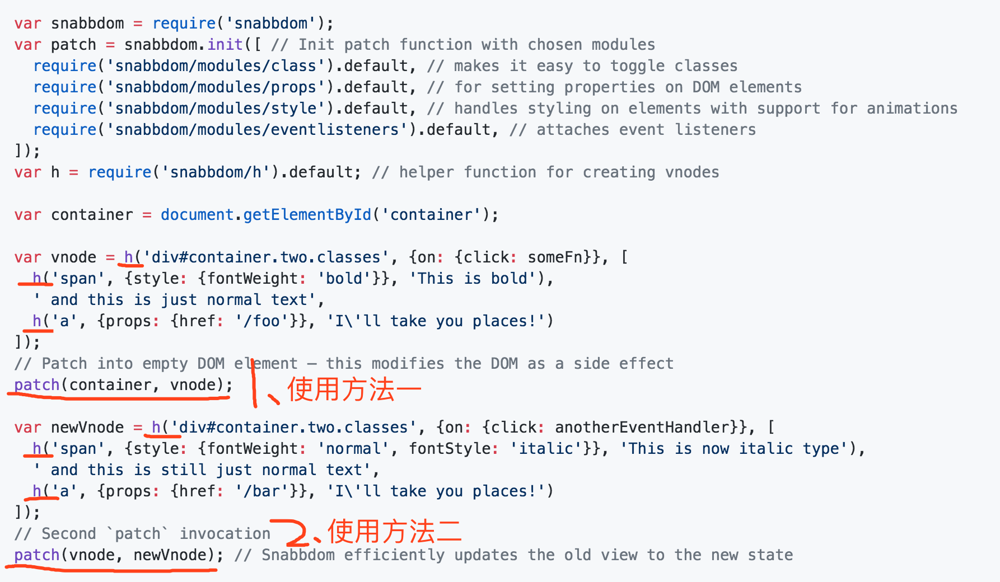
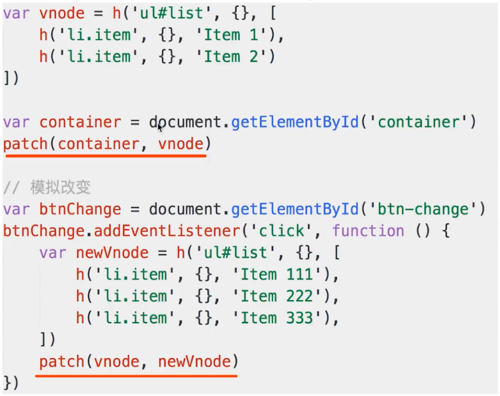

# 什么是vdom

**什么是vdom？**
 - virtual dom，虚拟DOM，
 - 用JS来模拟的DOM结构（不是真正的DOM）： dom是什么样的结构，我们就用JS模拟什么样的结构。dom有标签名字我们可以用JS模拟，dom有属性我们可以用JS模拟。dom有子节点我们也可以用Js来模拟。dom文本节点我们就用js字符串来模拟。

**为什么要用JS来模拟DOM呢？**
因为DOM操作是非常昂贵。所以必须尽量少的操作DOM。所以，我们就需要知道哪些dom需要操作、哪些操作不需要操作，而要找到哪些dom需要操作，哪些dom不需要操作，我们就需要用JS来执行很多逻辑、很多运算。

所以，归根结底，还是dom操作非常昂贵，所以，必须将dom对比操作放在JS层，来提高效率。

对比，是为了找出那些该动、哪些不该动，这是一个算法，在前端只能用JS来执行。


**为什么使用vdom?**
 - 因为DOM操作是非常昂贵。所以必须尽量少的操作DOM。
 - 既然最大限度的少操作DOM, 那就要找出变化的DOM，只操作要改动的DOM，其他节点不动。在前端我们只能用JS来做这项操作。将DOM对比操作放在JS层，提高效率。

**实例**

```html
<ul id="list">
    <li class="item">item1</li>
    <li class="item">item2</li>
</ul>
```

上面html对应的vdom如下，就是一段JS代码：
```javascript
{
    tag: 'ul',
    attrs: {
        id: "list"
    },
    children: [
        {
            tag: "li",
            attrs: {
                className: "item"
            },
            children: [
                "item1"
            ]
        },
        {
            tag: "li",
            attrs: {
                className: "item"
            },
            children: [
                "item1"
            ]
        },
    ]
}
```


# 什么是vdom - jquery

缺点：每次都要对一整块DOM全部操作，效率低。无法满足生产需求  也就是这种方法是没办法应用在生产环境下的。


# vdom如何应用？核心API是什么？

## snabbdom
snabbdom 是一个虚拟DOM库。vue2.0就是借用了snabbdom的代码。

github snabbdom: https://github.com/PandoraG/snabbdom

下面，看下snabbdom库说明中的一段code:




snabbdom最主要的API（也是vdom最主要的API）:
 - h() - 定义一个vnode节点。即虚拟节点。h()函数最终生成的就是一个JS对象，这个JS对象就是vnode。
 - patch()：

patch函数有两种用法，

1）第一种用法，第一个参数是一个真实的空的dom节点，第二个参数是个vnode，执行的是将vdom插入这个真实的节点中。也就是第一次渲染，将虚拟dom, 渲染到一个空白的容器中；

2)第二种用法，第一个参数是vnode，第二个参数是改动后的vnode。也就是我们的数据源改动了，那么就用新的数据源生成一个新的vnode——newVnode, 这个时候patch, snabbdom这个库会帮我们做一个复杂的对比，这个对比呢会只找出需要对比的那个部分更新，其他不需要更新的我一个都不会动。这就是我们所说的尽量减少dom更新。

还是上面那个实例，我们用snabbdom的h()来写下：
```javascript
// h() 最终生成的就是vnode, 就是一个js对象，这个js对象用来模拟真实的node节点
var vnode = h("ul#list", {}, [
        h("li.item", {}, "item1"),
        h("li.item", {}, "item2")
    ]);
```

下面再看一个简单的例子：
<!--  -->


## 总结
h()函数两种用法：
 - `h('标签名'， {...属性...}, '子元素'])`
 - `h('标签名'， {...属性...}, [...子元素...])`

patch()函数两种用法：
 - patch(container, vnode) - 初次渲染，将vnode内容全部patch到一个空白的容器里面。
 - patch(vnode, newVnode) - re-render再次渲染，将新的vnode和旧的vnode对比，对比完之后呢，把那些应该修改的节点修改，不应该修改的节点不修改。

### 本节的两个问题
 - 如何使用？可用snabbdom用法的例子距离
 - 核心API: h(), patch(): 注意说下patch函数的两种用法。

# diff算法

## 什么是diff算法

linux中有一个diff命令：
```shell
diff log1.txt log2.txt   # 找出log1.txt文件和log2.txt文件中不同的地方
```

git中的diff命令：
```shell
git diff xxxx文件  #git diff命令查看两个版本中更新变动的地方
```

很多的在线工具提供diff对比功能。
 
## 去繁化简
 - diff算法非常复杂，实现难度很大，源码量很大。
 - 去繁就简，讲明白核心流程，不关心细节。（学习编程一定将就2-8原则，研究框架也是，一定要去繁就简，化百分之二十的时间研究最核心的概念，学习也一样，要将就方法）。

## vdom为何用diff算法
 - dom操作是非常“昂贵”的，因此尽量减少dom操作。
 - 所以，要找出本次dom必须更新的节点来更新，其他的不更新。
 - 这个“找出”的过程，就是diff算法。
 - vdom中的diff算法是找出两个虚拟dom之间的差异。找出差异之后，我们更新必须要更新的，其他的不更新。


## diff算法实现流程

## 总结

### 问题解答

#### 知道什么是diff算法
它是linux中一个基础命令，git也有这个命令。它并不是vue提出来的什么高大上的东西，相反它是一个非常基础的东西。

#### vdom用diff算法的目的
 - vdom应用diff算法是为了找出需要更新的节点。

#### diff算法实现

理解snabbdom库中patch()函数的实现就行了。
 - patch(container, vnode)
 - patch(vnode, newVnode) 

