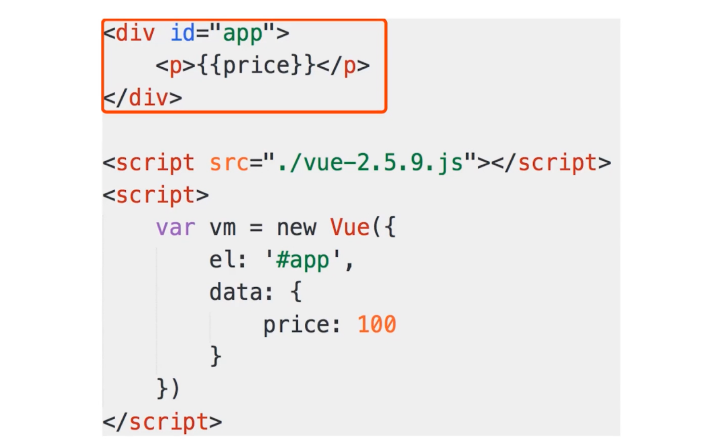
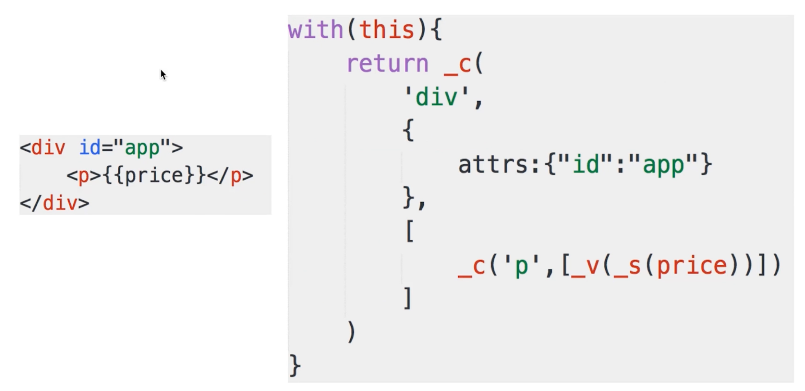
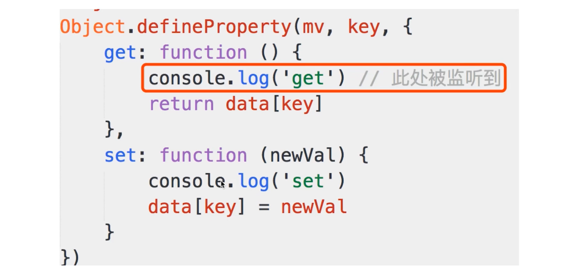

# 开始

# 从jQuery到框架
## jquery
## Vue
## 区别
## 总结


# 如何理解MVVM
## MVC

不论是MVC也好、还是MVVM也好，它们都是一种理念、模式。

MVC出现的比较早、MVVM是最近几年出来的。

MVC是用于后端的一种设计模式：
 - M - Modle 数据、数据源（如果用前端的思维想的话，modle包括data属性+接口数据）
 - V - View 视图、界面（就是用户在屏幕上能够看到的一些东西，如：按钮、输入框、列表等）
 - C - Controller 控制器、逻辑处理

### 三者之间的关系区别
view 是视图、Controller 是控制器、Modle是模型。view是显示数据的、controller是修改数据的、Modle是数据源。它们三者通过这种关系呢相互干预。

C-控制器能够控制view的变化也能控制modle的变化。一般是这样，view发出什么命令到controller，然后，controller控制Modle，然后Modle再去改view。

## MVVM

> mvvm主要解决了mvc中大量的DOM 操作使页面渲染性能降低，加载速度变慢，影响用户体验。

刚刚说了MVC是用于后端，那么MVVM是用于前端的一种设计模式。

MVVM算是MVC基础上的一个微创新。之所以说它是微创新，是因为VM就是viewModle，而前面的MV和MVC中的MV是一样的。它的这种微创新就是为了适应前端开发。

MVVM:
 - M - Modle 模型、数据。
 - V - View 视图、模板（视图和模型是分离的）。
 - ViewModle - 连接View 和 Modle。

下面以vue示例来说说：
一个vue实例或者一个vue组件也好，基本上包括三部分：template、script、style。
```
template

script
     data

style
```

那么，template就是View、script就是ViewModle，而script里面的data就是Modle。

下面看下这张图：


首先，我们看看官网中给的那种View 、ViewModle、Modle三者的关系图。在这个图中：
 - View - 下面标记为DOM
 - ViewModle - 下面标记为Vue
 - Modle - 标记为`plain javascript object`，也就是它就是一个简单的JS对象。

另外，在vue1.0文档里面，在实例化一个Vue实例时，官网文档中都把实例化vue实例赋值给一个名为vm的变量。这个vm就是ViewModle。而vm又是Vue实例，所以vue就是ViewModle。

 - 数据，通过ViewModle完成了对视图的绑定。
 - 视图，在视图里面绑定一个事件，那么需要ViewModel来操作Modle，因为视图中绑定的事件就是ViewModle中的方法嘛。
 - 所以，ViewModle就是view和Modle之间连接的一个桥。这也就是ViewModle名字的由来。
 - view 通过事件绑定操作 Modle.
 - Modle 通过数据绑定操作 View。

vue中为什么数据和视图能够分离，就是有viewModle这么一个桥。 桥的存在就能够彻底分离View和Modle。

### 关于MVVM
其实MVVM并不能完全把它看做是一种创新的设计模式吧，毕竟它是把之前后端用的MVC模式拿到了前端，但是又不能说直接完全照搬的拿来就用，肯定要根据前端的使用场景进行一些修改。而这里的修改就是ViewModle。也就是把原先的Ctronller创新性的改成了ViewModle。

## mvvm和mvc区别？它和其它框架（jquery）的区别是什么？哪些场景适合？
mvc和mvvm其实区别并不大。都是一种设计思想。主要就是mvc中Controller演变成mvvm中的viewModel。mvvm主要解决了mvc中大量的DOM 操作使页面渲染性能降低，加载速度变慢，影响用户体验。

 - 区别：vue数据驱动，通过数据来显示视图层而不是节点操作。
 - 场景：数据操作比较多的场景，更加便捷。


## 总结
 - MVVM - Modle View ViewModle
 - 三者之间的联系，以及如何对应各段的代码
 - ViewModle的理解，联系View和Modle


# Vue三要素 (vue实现原理)

理解三要素，你就能知道一个Vue或者MVVM框架是如何做出来的。

## 响应式：vue是如何监听data的每个属性变化？

### 什么是响应式
 - 修改data属性之后，Vue立即监听到
 - data属性被代理到vm上。


### Object.defineProperty

这个`defineProperty` API在ES5中就已经加入了。所以，现在在我们普遍简单的浏览器以及手机浏览器中都是支持的。

define property从名字上看就是定义属性嘛。

通过实例看看，vue是如何data属性变化的。则是vue响应式的基础。

```javascript
// 1. 直接对静态对象的静态属性
// 可以设置、可以获取
// 但是无法监听
var obj = {
    name: 'zhangsan',
    age: 25
}
console.log(obj)


// 2. 使用Js对象API defineProperty
// 
// defineProperty
// @param { Object } obj   - 一个对象
// @param { String } name  - 一个字符串
// @param { Object } {}    - 一个对象，对象里面包含两个方法：get()、set()

var obj = {}
var _name = 'shangsan'
Object.defineProperty(obj, 'name', {   //通过defineProperty给obj设置属性值name
    /*
    属性值的获取和设置都是通过get() set()函数来做的
     */
    get: function () {
        console.log('get', _name) // 自己的逻辑，监听
        return _name
    },
    set: function (newVal) {
        console.log('set', newVal)  // 自己的逻辑，监听
        _name = newVal
    }
})
// console.log( obj.name );   //被访问时，可以监听到
// obj.name = '99';    //被设置时，可以监听到
```


### 模拟
通过一个实例，来模拟实现vue中是如何监听data对象属性的。

下面，模拟vue如何监听对象属性变化，以及对象属性如何代理到vm上。
```javascript
// 1. vue实例化代码
// var vm = new Vue({
//     el: '#app',
//     data: {
//         name: 'zhangsan',
//         age: 20
//     }
// })


// 2. 我们的模拟实现代码，模拟实现上面代码的功能
// 两个问题：
//   1).vue怎么监听到name、age两个属性的变化。通过definePropery API实现。
//   因为definePropery它能吧属性的获取和设置定义到函数里面，然后我们就是在
//   函数里面来做监听变化的。
//   2).怎么把data的两个属性代理到vm对象。 也是通过definePropery API实现的，
//   defineProperty就是定义属性，通过for in data将data里的属性定义到vm对象。
var vm = {}
var data = {
    name: 'zhangsan',
    age: 20
}

var key, value
for (key in data) {  // 对data进行遍历
    // 命中闭包，新建一个函数，保证key的独立作用域
    (function (key) {

        Object.defineProperty(vm, key, {
            get: function () {
                console.log('get', data[key]) // 监听
                return data[key]
            },
            set: function (newVal) {
                console.log('set', newVal) // 监听
                data[key] = newVal
            }
        })
    })(key);
}
```

### 小结
 - 关键是理解definePropery，这函数的用法
 - 将data属性代理到vm上


## 模板解析：vue的模板如何被解析？指令如何被处理？

vue中如何解析模板？理解这个问题需要理解：
 - 模板是什么
 - render函数
 - render函数与vdom

### 模板是什么
 - 本质：就是字符串
 - 但是他有逻辑，有v-if、v-for等命令
 - 与html很像，但是有很大区别。（html是死的 静态的，但是vue的模板中它有指令，是动态的）
 - 但是 模板最终还是要转成html来显示

模板最终要转换成JS代码，因为：
 - 模板有逻辑(v-if, v-for等)，必须用JS才能实现。
 - 模板要转换成html渲染页面，必须要用JS才能实现。
 - 因此，模板最终要转换成一个JS函数（render函数）


## render函数：vue模板如何被渲染成html?以及渲染的过程？以及data属性改变后，又是如何从新渲染的


### render函数 - with用法

为什么讲with呢?  

因为vue里面render函数使用到with。

```javascript
var obj = {
  name: 'zhangsan',
  age: 20,
  getAddress: function() {
    alert('beijing');
  }
}

// 不用with
function fn() {
  alert(obj.name);
  alert(obj.age);
  getAddress();
}
fn();


// 用with
function fn1() {
   with(obj) {
      alert(name);
      alert(age);
      getAddress()
   }
}
fn1();
```

### 模板解析是如何将模板转换成JS函数(render)

通过模板转换为render函数，解决了模板中“逻辑”(v-if和v-for等)和绑定事件问题。

下面，通过看个实例，来理解下模板解析成js render函数的过程：



上面红框中最终生成的render函数体如下：



我们总结下:
 - 模板中所有的信息都包含在了`render`函数中
 - `this`即`vm`
 - `price`即`this.price`即`vm.price`，即`data`中的`price`
 - `_c`即`this._c`即`vm._c`_

### 最后，如何生成html渲染页面的? vm.c是什么？ render函数返回了什么？

 - `render`函数返回的内容就是`vm.c`是什么。
 - `vm._c`函数就相当`snabbdom`中的`h()`函数_
 - `render`函数返回的是`vnode`

如何生成html渲染页面的：
 - `updateComponent` 中实现了`vdom`中的`patch`
 - 页面首次渲染执行`updateComponent`
 - `data`中每次修改属性，执行`updateComponent`重新渲染改动的地方

### 总结

- 模板 - 本质 字符串、有逻辑、嵌入JS变量...
- 模板必须要转换为JS代码(字符串、有逻辑、嵌入JS变量)
- 模板转换成render函数是什么样子的
- render函数执行是返回vnode
- updateComponent


# Vue的整个实现流程
## 第一步  解析模板生成render函数
## 第二步  响应式开始监听
## 第三步  首次渲染，显示页面，且绑定依赖
 - 初次渲染，执行updateComponent，执行`vm._render()`
 - 执行render函数，会执行到vm.list和vm.title
 - 会被响应式的get方法监听
 - 执行updateComponent，会走到vdom的patch方法
 - patch将vdom渲染到页面，初次渲染完成

### 怎么监听依赖呢？



思考：为甚要监听get呢？在设置修改属性后在set里面不就可以监听吗？当属性被设置或修改了直接在set里面修改页面元素不是就行了吗，干嘛还非要在get中监听。
 - data中的属性很多，有些被用到，有些可能没被用到
 - 被用到的会走get，不被用到的不会走到get
 - 未走到get的属性，set的时候我们无需关心
 - 避免不必要的重复渲染 

## 第四步  data属性变化，触发rerender 
 - 修改属性，被响应式的set监听到
 - set中执行updateComponent
 - updateComponent重新渲染vm._render()
 - 生成vnode和preVnode, 通过patch对比
 - 渲染到html中
