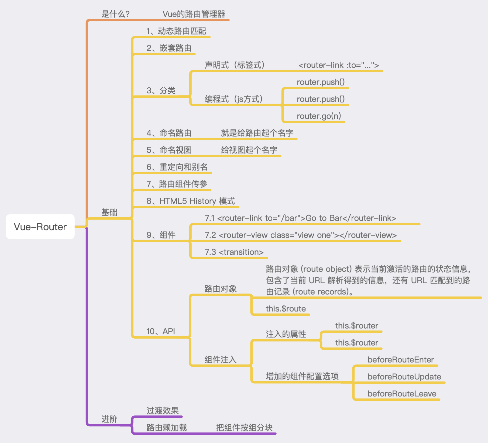

> Vue Router： https://router.vuejs.org/zh/
> 
> Vue Router 是 Vue.js 官方的路由管理器。它和 Vue.js 的核心深度集成，让构建单页面应用变得易如反掌。
> 
> API:
> https://router.vuejs.org/zh/api/#scrollbehavior



# vue-router基础概念
 - 一个视图用一个组件来渲染


# 实现原理


# 路由跳转

## 声明式（标签式）

## 编程式（js方式）


# 路由嵌套

1. 第一步 配置嵌套路由 

```javascript
const router = new VueRouter({
  routes: [
    { 
      path: '/user/:id', 
      component: User,
      children: [
        {
          // 当 /user/:id/profile 匹配成功，
          // UserProfile 会被渲染在 User 的 <router-view> 中
          path: 'profile',
          component: UserProfile
        },
        {
          // 当 /user/:id/posts 匹配成功
          // UserPosts 会被渲染在 User 的 <router-view> 中
          path: 'posts',
          component: UserPosts
        }
      ]
    }
  ]
})
```

> 嵌套的子组件，不需要加路径了。只需要写组件名字即可。

2. 第二步 在组件中中添加`<router-view></router-view>`


# 路由传参
  
## 声明式
```html
<!-- 1. 第一种 -->
<router-link :to="{ name:'master', params: {count: 110} }">专家</router-link>
<!-- 此时，页面url -->
http://localhost:8080/master/110
<!-- 此时， 组件中接受参数方法 -->
this.$route.params  <!-- {count: 110} -->


<!-- 2. 第二种 -->
<!-- 此时， 不建议这么写，因为获取参数会很麻烦 -->
<router-link :to="{ path:'/master', query: {count: 110} }">专家</router-link>

<!-- 3. 第三种 -->
<router-link to="/master/150/{name:'iwen'}">专家</router-link>
```

多参数传递：
```html
<router-link :to="{ name:'master',params: {count: 110, type: obj} }">专家</router-link>
```
```javascript
data() {
  return {
    obj: { hh: 1 }
  }
}

{
      path: '/master/:count/:type',
      name: 'master',
      component: Master
}
```

# 路由高亮

怎么设置点击哪一个按钮，哪个按钮就高亮呢？

1. 首先，路由文件`router.js`文件中全局设置中添加：
```javascript
mode: "history",  //支持浏览器history模式
linkActiveClass: "active",  // 自定义激活按钮class类名
```

2. 其次，全局样式 or 主入口组件中添加高亮样式
```javascript
.active {
  color: red;
}
```

3. 最后 注意，给跳转主页的`router-link组件`添加精确匹配——`exact`
```html
<router-link exact to="/">首页</router-link>
```


