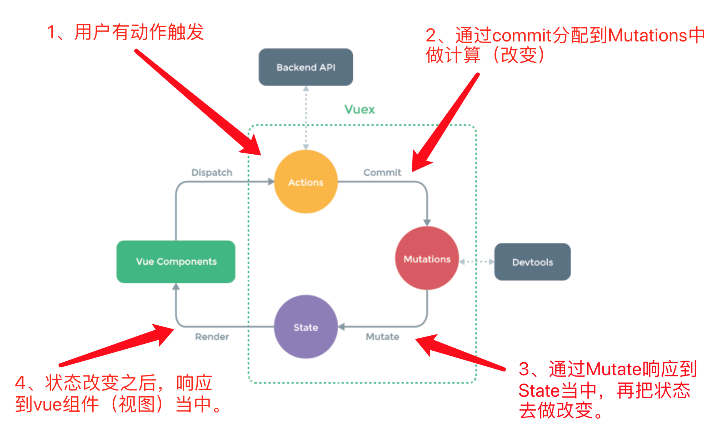

# 子父级组件交互


# VueX

## 什么是Vuex
 - Vuex 是一个专为 Vue.js 应用程序开发的状态管理器（模式），就是把组件的共享状态取出来，以一个全局单例模式管理，这样，不管在任何时候，都能获取状态或者触发行为；
 - 它采用集中式存储管理应用的所有组件的状态。
 - 并以相应的规则保证状态以一种可预测的方式发生变化。
    

## 什么情况下使用vuex
虽然 Vuex 可以帮助我们管理共享状态，但也附带了更多的概念和框架。这需要对短期和长期效益进行权衡。

如果您不打算开发大型单页应用，使用 Vuex 可能是繁琐冗余的。确实是如此——如果您的应用够简单，您最好不要使用 Vuex。一个简单的 global event bus 就足够您所需了。

但是，如果您需要构建是一个中大型单页应用，您很可能会考虑如何更好地在组件外部管理状态，Vuex 将会成为自然而然的选择。

 - 使用: 中大型项目;
 - 不适用: 小项目;


## Vuex状态管理流程



view -> (dispatch) Action -> (Commit) Mutations -> (Mutate) State -> View

注意:
 - Action不是必需品，如果有异步操作才可能用到Action，否则可以不使用
 - Mutations是同步的。


### Actions与mutations的区别
 - Mutations中包含的是同步操作（必须是同步的，不能包含异步的操作）。
 - Actions中包含的是异步操作。如果需要调用请求获取数据，则必须使用Actions了。
 - Action 提交的是 mutation，而不是直接变更状态。
 - Action 可以包含任意异步操作。

### 实际使用Vuex

#### 第一步 在项目根目录，创建一个`store`目录，在新创建的目录中添加一个`index.js`文件。

```javascript
import Vue from "vue"
import Vuex from 'vuex'

Vue.use(Vuex)

// 创建一个store仓库模块
export default new Vuex.Store({
    // --------------------------------------------- 状态
    // 因为store实例时注入到vue实例上的，所以任何组件都可以读取这里的状态
    state: {
        count: 10,
        name: 'G-Dragon'
    },
    // ---------------------------------------------actions, 异步操作，
    // @param { Object } context - 上下文
    // 
    // actions中执行的函数，最终执行的是mutations中的函数
    // 通过context.commit('xxxx')执行
    actions: {
        // context:承上启下
        increment(context) {
            setTimeout(function() {
                context.commit("increment");
            })
        },
        decrease(context) {
            setTimeout(function() {
                context.commit("decrease");
            })
        }
    },

    // --------------------------------------------- mutations
    // @param { Object } state - 状态对象 
    mutations: {
        increment(state) {
            state.count++;
        },
        decrease(state) {
            state.count--;
        }
    },

    // state中数据的派生
    // Vuex 允许我们在 store 中定义“getter”（可以认为是 store 的计算属性）。
    // 就像计算属性一样，getter 的返回值会根据它的依赖被缓存起来，且只有当它的依赖值发生了改变才会被重新计算。
    getters: {
        getState(state) {
            return state.count > 0 ? state.count : 0
        }
    }
});

```

#### 第二步 在main.js文件中，引入vuex 

store文件，并注入到vue实例中。这样所有的组件都可以使用store。

main.js：
```javascript
// The Vue build version to load with the `import` command
// (runtime-only or standalone) has been set in webpack.base.conf with an alias.
import Vue from 'vue'
import App from './App'
import store from "./store"

Vue.config.productionTip = false

/* eslint-disable no-new */
new Vue({
    el: '#app',
    template: '<App/>',
    store,
    components: {
        App
    }
})
```

#### 第三步 任何一个组件中怎么获取vuex store状态仓库中的状态呢？

例如，在某个组件中获取store中的name:

```html
<template>
    <div>my name: {{ getName }}</div>
</template>

<script>
    
export default{
    name: "xxx",
    data() {
        return{
          //
        }
    },
    // 要想获取vuex状态仓库中的状态，需在计算属性中获取
    computed: {
        getName() {
            return this.$store.state.author;
        }
    }
}
</script>

<style>
</style>

```

 
#### 第四步 怎么修改vuex store中的状态呢？

#####  方法一： 最基本的修改store中状态的方法——store.commit()

先定义mutations:
```javascript
// 要想视图修改store中的状态必须显示的在mutations中声明响应的处理函数
// 下面，在store仓库文件中添加如下代码
...
mutations: {
    fullname(state) {
        state.name = "Pandora " + state.name;
    }
},
...
```

然后，在组件中定义相应方法。在方法中执行commit将操作分配到Mutations中去改变状态。
```html
<template>
    <div>
        my name: {{ getName }}
        <button @click="add">show fullname</button>
    </div>
</template>

<script>
    
export default{
    name:"outer",
    data(){
        return{
        
        }
    },
    // 要想获取vuex状态仓库中的状态，需在计算属性中获取
    computed: {
        getCount() {
            // return this.$store.state.count;
            return this.$store.getters.getState;
        },
        getName() {
            return this.$store.state.author;
        }
    },
    methods: {
        add() {
            // this.$store.commit("increment");
            this.$store.dispatch("increment");
        }
    }
}   

</script>

<style>
```


##### 方法二：通过actions来执行mutations中的函数，进而修改状态

首先，在store 状态文件中添加actions。
```javascript
    mutations: {
        fullname(state) {
            state.name = "Pandora " + state.name;
        }
    },
    // 下面是新加的code
    actions: {
        // context:承上启下
        // 这里用定时器来模拟异步操作，设置为2秒钟后将名称改为全称
        changeName(context) {
            setTimeout(function() {
                context.commit("fullname");
            }, 2000)
        },
    },

```

> 注意：actions里的函数内部，最终触发的还是mutations中的方法。


之后，在组件中使用`store.dispatch()`执行actions中的方法。
```javascript
    methods: {
        // add() {
        //     // this.$store.commit("increment");
        //     this.$store.dispatch("increment");
        // },
        // fullName() {
        //     this.$store.commit('fullname');
        // },
        fullName2() {
            this.$store.dispatch('changeName');
        }
    }
```

### getter的使用方法
 - getter可以被理解为是依赖于state中状态的计算属性。这里定义的计算属性可以在所有组件中获得。

首先，在store 文件中添加getters属性对象，里面写你要添加的计算属性。
```javascript
import Vue from "vue"
import Vuex from 'vuex'

Vue.use(Vuex)

// 创建一个store仓库
export default new Vuex.Store({
    state: {
        count: 10,
        author: 'G-Dragon'
    },
    mutations: {
        increment(state) {
            state.count++;
        },
        decrease(state) {
            state.count--;
        },
        fullname(state) {
            state.author = "Pandora " + state.author;
        }
    },

    actions: {
        // context:承上启下
        increment(context) {
            setTimeout(function() {
                context.commit("increment");
            })
        },
        decrease(context) {
            setTimeout(function() {
                context.commit("decrease");
            })
        },
        changeName(context) {
            console.log('store change name');
            setTimeout(() => {
                context.commit('fullname');
            }, 2000)
        }
    },

    // 新添加的getters
    getters: {
        getState(state) {
            return state.count > 0 ? state.count : 0
        }
    }
});
```

组件中使用方法：
```javascript
// 同样是在计算属性中获取
// 要想获取vuex状态仓库中的状态，需在计算属性中获取
    computed: {
        getCount() {
            // return this.$store.state.count;
            return this.$store.getters.getState;
        },
    },
```


## 总结：再理解Vuex几大属性
 - State：vuex中的共享状态对象。
 - Getter：依赖于State中状态的`计算属性`。
 - Mutation：最终执行改变state中状态属性的函数对象
 - Action: 执行异步提交，提交的是Mutations中的函数方法。
 - Module: 模块化，没有用过。
