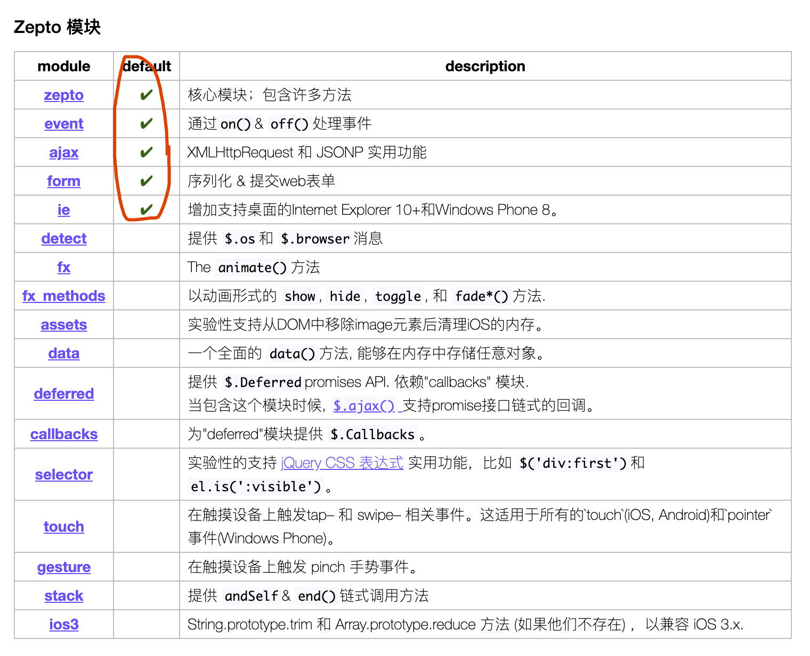

# 背景
调研对比了下zepto、jquery Mobile, 最终选择是今后我们移动端项目就使用zepto;

zepto: 
  - 更轻（5-10k）
  - 性能效率更高
  - 语法基本与 jquery 一样（jquery移动端版本）

<br />

# 安装
```shell
# 项目跟不来下
npm i zepto --save
```

<br />

# 遇到的问题
 - 1、zepto 库本身不支持 CommonJs 规范，不支持 import/export，所以不能直接以 import 的形式引入，所以这里需要做一些特殊处理；
 - 2、zepto默认构建只包含: Core, Ajax, Event, Form, IE几个模块；

## 问题一：
```shell
$ npm i -D script-loader exports-loader
```

修改 webpack 配置文件：
```shell
// webpack.config
{
  // ...
  module: {
    loaders: [{
      test: require.resolve('zepto'),
      loader: 'exports-loader?window.Zepto!script-loader'
    }]
  }
}
```

这样一来，我们就可以在入口文件中这样写了：
```js
// entry.js
import $ from 'zepto'

...
```


## 问题二：
zepto默认构建只包含: Core, Ajax, Event, Form, IE几个模块。意思也就是说，问题一解决后。我们要想使用zepto 的animation方法（fx模块下的）
是会报错的。怎么办呢？我们要先引入这个模块，之后才能使用它。

下面是zepto 安装包下的模块文件：


为了方便，我把这部分配置写在了 `common/es6Module/myzepto.js` 文件下了，内容如下：

```js
require('./../../node_modules/zepto/src/zepto');
require('./../../node_modules/zepto/src/event');
require('./../../node_modules/zepto/src/ajax');
require('./../../node_modules/zepto/src/form');
require('./../../node_modules/zepto/src/ie');
require('./../../node_modules/zepto/src/fx');
require('./../../node_modules/zepto/src/fx_methods');
require('./../../node_modules/zepto/src/deferred');
require('./../../node_modules/zepto/src/callbacks');
require('./../../node_modules/zepto/src/touch');

window.Zepto = Zepto;
window.$ === undefined && (window.$ = Zepto);

module.exports = $;
```
> 注意：各模块的引入顺序。zepto 对此很 **敏感** ！

这样做是为了 **更好定制**，根据项目需要哪些模块就引用进来。


<br />

# 实际项目中使用
```js
import $ from '../../../../common/es6Module/myzepto';
```


<br />

# 阅读
 - [webpack中使用zepto](https://segmentfault.com/a/1190000009121850)
 - [如何在 webpack 中引入未模块化的库，如 Zepto](https://sebastianblade.com/how-to-import-unmodular-library-like-zepto/)
 - [zepto 中文文档](https://www.html.cn/doc/zeptojs_api/)

